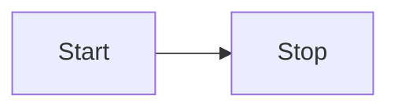

## 1. 3D Codeblocks

> Puede mostrar formatos _3D_ como lo son `.glb`, `.gltf` o `.stl`

```3d
[[Dragon 2.5_stl.stl]]
```

## 2. Advanced Canvas

> Este plugin ofrece una mejor experiencia utilizando canvas:
>
> > 1. **Personalización de flechas**
> > 2. **Personalización de formas y bordes**
> > 3. **Modo presentación** : las diapositivas (slides, imágenes, formas) se unen con flechas de forma ordenada
> > 4. **Visualización de Canvas incrustados**

![[😺Sin Categoría/Anexos/Advanced Canvas.png]]
Para iniciar la presentación se utiliza el comando: _Advanced Canvas: Start presentation_

## 3. Advanced Slides

> Crea presentaciones con pizarra

![[😺Sin Categoría/Anexos/image-42.png]]

[themes](https://mszturc.github.io/obsidian-advanced-slides/themes/)

## 4. Advanced Tables

> Este plugin permite mover dinámicamente las celdas y hacer operaciones matemáticas con la siguiente [documentación ](https://github.com/tgrosinger/md-advanced-tables/blob/main/docs/formulas.md), para resumir sus funcionalidades esta el siguiente [enlace](https://chatgpt.com/share/6a47f20b-a3e0-83e8-a655-ef97852fb1e9)

| Item              | Grams |
| ----------------- | ----- |
| Bread Flour       | 748   |
| Salt              | 18    |
| Starter           | 40    |
| Warm Water        | 691   |
| Whole Wheat Flour | 110   |
| **Total Grams**   | 1607  |

<!-- TBLFM: @>$2=sum(@I..@-1) -->

## 5. Agentage Galaxy

> Es un visor estilo 3D de la visión gráfica
> ![[😺Sin Categoría/Anexos/Screen Recording 2026-07-21 093217.mp4]]

## 6. Arrow

> Puede formar líneas en el texto
>
> > **Desventajas**
> >
> > - No se muestra en modo lectura
> > - Presenta los comandos que activan las flechas en modo lectura
> >   _Solución:_ encerrar los comandos entre comentarios estilo html

![[😺Sin Categoría/Anexos/arrow.png]]

## 7. Article Navigator

> Se utiliza para navegar por medio de botones determinadas notas que compartan un mismo archivo, se hace por medio de las propiedades

![[😺Sin Categoría/Anexos/Article Navigator.png]]

## 8. Audio Player

> Es otra forma de insertar un audio, su estilo permite ver la frecuencia de volumen del audio

```audio-player
[[colby-To Each Their Own.mp3]]
```

## 9. Audio Sidebar

> Este plugin se utiliza para tener un reproductor de música de obsidian

- **Desventajas:**
  - Deshabilita el reproductor de audio nativo de obsidian lo que incluye el _Audio Player_
  - Se abre automáticamente cada que se recarga o se ingresa a la bóveda (puede ser molesto)

Todas las canciones se encuentran almacenadas en el archivo **🎵Music** y la descarga directo de Spotify se realiza con la aplicación local [[Sunnify-Windows.exe]]

![[😺Sin Categoría/Anexos/Audio Sidebar.png|381]]

```audioscene
name: Canción Favorita
music: 🎵Music#colby-To Each Their Own
```

```audiosidebar
🎵Music#colby-To Each Their Own
```

```audiosfx
🎵Music#colby-To Each Their Own
```

```audioloop
🎵Music#colby-To Each Their Own
```

```audiofadeoutall
Fade out all audio
```

## 10. Avatar

> Genera separadores de dos columnas

```avatar
image: https:/i.pinimg.com/736x/91/30/10/9130109792b75c67b875993b68417830.jpg
description: |
  La luz entra suave por la ventana,
  como si el día susurrara su nombre.
  Él descansa su mundo en una mano,
  y en la otra, el silencio se esconde.

  Un gato negro, sombra tranquila,
  vigila el tiempo sobre la mesa,
  mientras el café humea despacio
  como un pensamiento que no pesa.

  Sus ojos no miran, sueñan,
  perdidos en algo que no vemos,
  tal vez en historias pequeñas
  que solo nacen cuando no hablamos.

  El aire parece detenido,
  como si temiera romper la calma,
  y en ese instante sencillo
  cabe todo: la vida y el alma.

  No hay prisa, no hay ruido,
  solo luz, calor y compañía,
  un momento tan frágil y puro
  que parece eterno… todavía.
```

## 11. Bases Buttons

> Este plugin hace automatizaciones de diferentes acciones escritas en _html_ en plantillas por medio de bases de datos

Se necesita de un plugin adicional **Templates**
![[😺Sin Categoría/Anexos/Bases Buttons.png]]

## 12. Better Footnote

> Obsidian ya ofrece un servicio de pies de notas pero este plugin mejora la visualización, _se adjunta tabla comparativa_

| Obsidian                 | Plugin                   |
| ------------------------ | ------------------------ |
| ![[😺Sin Categoría/Anexos/BetterFootnote2.png]] | ![[😺Sin Categoría/Anexos/BetterFootnote1.png]] |

```chartspark
{
  "type": "bar",
  "data": {
    "labels": [
      "![[BetterFootnote2.png]]"
    ],
    "datasets": [
      {
        "label": "Plugin",
        "data": [
          0
        ],
        "backgroundColor": "rgba(76, 155, 232, 0.85)",
        "borderColor": "#4c9be8",
        "borderWidth": 2
      }
    ]
  },
  "options": {
    "responsive": true,
    "plugins": {
      "legend": {
        "position": "top"
      },
      "title": {
        "display": false
      }
    },
    "scales": {
      "y": {
        "beginAtZero": true
      }
    }
  },
  "meta": {
    "generated": "2026-07-06T17:08:41.773Z",
    "patternType": "table",
    "columnSelection": {
      "labelColIndex": 0,
      "valueColIndices": [
        1
      ]
    },
    "source": {
      "file": "😺Sin Categoría/Clasificación de Plugins de Obsidian.md",
      "startLine": 225,
      "endLine": 227
    },
    "chartId": "n9cwospy"
  }
}
```

## 13. Better Headings

> Numera los títulos

![[😺Sin Categoría/Anexos/Better Headings.png]]

## 14. Blur

> Permite ocultar o desenfocar dentro del texto

---

Alpha Bravo Charlie `~{Delta}` Echo Foxtrot Golt Hotel India Juliet `~{Kilo}` Lima Mike November Oscar `~{Papa}` Quebec Romeo Sierra Tango Uniform Victor `~{Whiskey}` Xray Yankee Zulu

---

```blur-bone
Alpha Bravo Charlie Delta Echo Foxtrot Golt Hotel India Juliet Kilo Lima Mike November Oscar Papa Quebec Romeo Sierra Tango Uniform Victor Whiskey Xray Yankee Zulu
```

---

Alpha Bravo Charlie `~[Delta]` Echo Foxtrot Golt Hotel India Juliet `~[Kilo]` Lima Mike November Oscar `~[Papa]` Quebec Romeo Sierra Tango Uniform Victor `~[Whiskey]` Xray Yankee Zulu

## 15. Book Search Plus

> Busca libros según nombre y autor.
> ![[😺Sin Categoría/Anexos/Pasted image 20260617004955.png|434]]

## 16. Book Shelf

> Se utilizará para llevar un control de lectura de los libros citados y en lectura de la bóveda
> ![[😺Sin Categoría/Anexos/Book Shelf.png]]

## 17. Button

> Es una forma bonita de hacer acciones automatizadas
>
> - Se puede utilizar un script de CSS para una mejor personalización de diseño

**Desventajas:** Al actualizar la ubicación de un archivo se debe cambiar manualmente en el botón, no se actualiza como un enlace

![[😺Sin Categoría/Anexos/Button.png|320]]

## 18. Buttons Panel

> Sirve para tener un panel con botones a los cuales se les puede dar automatizaciones de todo tipo.
>
> - Los iconos se pueden importar en formato **SVG**

![[😺Sin Categoría/Anexos/Buttons Panel.png|274]]

## 19. Caissa

> Es un plugin para poder jugar ajedrez

![[😺Sin Categoría/Anexos/Caissa.png|458]]

## 20. CalcCraft

> Una forma muy simple de manejar los cálculos dentro de las tablas muy parecido a excel, [^1]comentario

| Descripción | Precio     |
| ----------- | ---------- |
| Mochila     | 50         |
| Comida      | 60         |
| **Total**   | =(b2+b3)/2 |

[Resumen de Formulas](https://chatgpt.com/share/6a4757e7-7970-83e8-b70b-f661c815fe72)

## 21. Calculator Pro

> Es una calculadora con una interfaz muy completa para realizar cálculos medianamente avanzados

![[😺Sin Categoría/Anexos/Calculator Pro.png|323]]

## 22. Calendar

> Es un calendario dentro de obsidian que lleva un registro de
>
> > - **Eficiencia de escritura de ese día**: se coloca 1 punto por cada 250 palabras escritas
> > - **Pendientes:** Coloca puntos vacíos si hay checklist pendientes

![[😺Sin Categoría/Anexos/Calendar.png|349]]

## 23. Canvas Card Background Remover

> Permite los **fondos transparentes** para imágenes, canvas y markdown en _Canvas_

![[😺Sin Categoría/Anexos/Canvas Card Background Remover.png|204]]

## 24. Canvas Export

> Cumple con la exportación de canvas en formato
>
> > - HTML
> > - D2 (por descubrir)
> > - EXCALIDRAW (muy útil)
> > - PDF (Bien)

Con la desventaja de no incrustar imágenes

![[😺Sin Categoría/Anexos/Canvas Export.png|413]]

## 25. Canvas Format Brush

> Emplea un botón de brocha para copiar el formatos en distintos niveles
>
> > Para hacerlo se usa la tecla ==\*\*Shift ↑\*\*==
> > **Desventajas:** No copia cambio de forma ni contorno

![[😺Sin Categoría/Anexos/Canvas Format Brush.png|480]]

## 26. Canvas HTML Exporter

> Mejora la exportación de **HTML** ya que incrusta todo tipo de files, lo permite tanto en formato claro y oscuro
>
> - **Desventajas:** Con canvas muy grandes existe una línea de error

<iframe src="file:///C:\Seagate Expansion\Universidad\Obsidian\Study Platform\🗳️Export Canva/index.html" width="100%" height="500px"></iframe>

## 27. Canvas MindMap

> Sirve para activar ciertas funcionalidades para crear fácilmente
>
> > - **Nodo hijo**: ==Tab ←→==
> > - **Nodo hermano**: ==Enter==

- **Desventajas:**
  - El nodo hijo y hermano no copia el formato al crearse
  - La función de `Canvas Mindmap: Split Heading into mindmap based on H1` no esta en funcionamiento
  - Solo funciona activando y desactivando con funciones
- **Ventajas:**
  - Se puede seleccionar el árbol completo

![[😺Sin Categoría/Anexos/Canvas MindMap.png|291]]

## 28. Canvas Minimap

> Genera un mini mapa para una visualización general del canvas

![[😺Sin Categoría/Anexos/Canvas Minimap.png|443]]

## 29. Canvas Send to Bac

> Se utiliza para colocar abajo o arriba los elementos en Canvas (esto puede ser muy útil para ocultar los nombres de los elementos)

![[😺Sin Categoría/Anexos/Pasted image 20260705202821.png|416]]

## 30. Card View

> Son bloques de código que permiten renderizar de forma estética información de diferentes categorías

- **Ventaja:** Se puede renderizar código en html
- **Desventaja:** Al correr el html el baúl debe _recargar_ dado que ya se puede usar normalmente

* **Dato:** Este plugin originalmente tenía las etiquetas en Chino pero configurando directamente el `C:\Seagate Expansion\Universidad\Obsidian\Study Platform\.obsidian\plugins\card-viewer\main.js` quitando los _escape Unicode chinos_ por palabras en español

```card-movie
id: 1356587
title: Chang'an Lychee
release_date: 2025-07-12
region: China
rating: 5
runtime: 122
genres: Drama, History, Comedy
overview: During the Tang Tianbao period, middle-aged Li Shande (Dapeng) grumbled through many jobs, spent a lot of money frugally, but still remained a nameless clerk. However, everything seemed to turn around with a summons. One day, someone arranged for him a lucrative position as "Lychee Envoy". If successful, it would mean wealth and a life reversal, but if he failed...
poster: https://www.themoviedb.org/t/p/w1280/zbTrwhUxxJ0BgDai1FflfeOELrO.jpg
```

```card-tv
id: 1396-Breaking Bad
title: Breaking Bad
release_date: 2008-01-20
region: United States of America
rating: 8.925
genres: Drama, Crime
overview: High school chemistry teacher Walter H. White is the sole breadwinner for his struggling family. Having lived most of his life law-abiding and diligent, he suddenly learns on his 50th birthday that he has terminal lung cancer, making his already difficult life even worse. To ensure his pregnant wife Skyler and disabled son Walter Jr. can live comfortably after his death, Walter decides to take desperate measures.
poster: https://www.themoviedb.org/t/p/w1280/ztkUQFLlC19CCMYHW9o1zWhJRNq.jpg
```

```card-book
id: 37359280
title: Artificial Girl
release_date: 2025-07
region: Malaysia
rating: 7.7
genres: Science Fiction, Fantasy
overview: "Artificial Girl" is the first novel by Malaysian Chinese writer Gong Wanhui. It tells the story of a near future where the world is destroyed by a plague. A weary father travels with his artificial daughter Lilika through city ruins reclaimed by jungle, passing through doors of memory to shuttle back to the past and experience buried memories.
poster: https://encrypted-tbn0.gstatic.com/images?q=tbn:ANd9GcSgP7EE2d1xfrEVTXPQZFF14nKBAXhHNwcReYzdKoanBQ&s=10
author: Gong Wanhui
publisher: Zhejiang Literature and Art Publishing House
isbn: 9787533980054
external_url: https://book.douban.com/subject/37359280/
```

```card-music
id: 2106636228
title: ENOUGH!
author: Eternxlkz
album: ENOUGH!
release_date: 2023-12-14
duration: 90
genres: Pop
poster: https://i.scdn.co/image/ab67616d00001e02f88fa662f78aac08d8dbe32a
url: https://163cn.tv/Ial8GCT
```

```html
<div style="padding: 20px; background: linear-gradient(45deg, blue, #4ecdc4); border-radius: 10px; color: white; text-align: center;">
  <h2>Hiromi Higuruma</h2>
  <p>Ejemplo de html</p>
  <button onclick="alert('My Love!')" style="padding: 8px 16px; border: none; border-radius: 5px; background: white; color: #333; cursor: pointer;">Click Me</button>
</div>
```

## 31. Card Note

> Se representa con el emoji de ✨ y presenta diferentes usos

- **Crear un archivo**
  - ![[😺Sin Categoría/Anexos/Crear un archivo-CardNote.png| Si no se quiere un enlace como en la imagen se da ==ctrl+z==  pero el archivo aun existirá en la carpeta default **Card Note**]]**Excalidraw:** Se puede poner o no el título del subtema
    $\,$
- **Enlazar con la nota**
  - ![[😺Sin Categoría/Anexos/Enlazar con la nota-CardNote.png| No se crear ningún archivo, una de las ventajas es que si se modifica la información enlazada también lo hara en el canvas]] **Excalidraw:** No pone el título del subtema
    $\,$
- **Enlazar texto**
  - ![[😺Sin Categoría/Anexos/Enlazar texto-CardNote.png| Genera un código de identificación → se realiza desde el canvas en **Reducir bloque**]]**Excalidraw:** También se puede hacer pero a veces hay que saber donde colocar el código (se puede usar primero canvas para saber donde colocarlo correctamente)
    $\,$
  - ![[😺Sin Categoría/Anexos/Enlazar texto2-CardNote.png|También se puede lograr extrayendolo desde el subtema enlazado]] **Excalidraw**: Aplica lo mismo
    $\,$
- **Cortar subtemas y texto**
  - ![[😺Sin Categoría/Anexos/Cortar subtemas y texto.png| Se elimina el texto del documento extraído]]**Excalidraw:** Aunque existe la opción solo borra el texto más no lo pega
    $\,$
- **Card View**
  - ![[😺Sin Categoría/Anexos/Card View-CardNote.png|Permite buscar archivos de una forma más visual]]

## 32. Charted Roots

> Este plugin tiene muchas funcionalidades pero dicho de forma general, se utiliza para llevar un registro históricos de lugares, personas y todo tipo de **entidades** (No se ha explorado a fondo)
>
> > - Todos los archivos generados se guardan en la carpeta **Charted Roots**

- **Recomendación:** 🚨Revisar en desarrollo de temas históricos
  ![[😺Sin Categoría/Anexos/Charted Roots.png]]

## 33. ChartSpark

> Genera gráficos

### 33.1. Con Templates

```chartspark
{
  "type": "line",
  "data": {
    "labels": [
      "Mon",
      "Tue",
      "Wed",
      "Thu",
      "Fri",
      "Sat",
      "Sun"
    ],
    "datasets": [
      {
        "label": "Value",
        "data": [
          7,
          6,
          0,
          5,
          0,
          5,
          0
        ],
        "fill": true,
        "tension": 0.4
      }
    ]
  },
  "options": {
    "responsive": true,
    "scales": {
      "y": {
        "beginAtZero": true
      }
    }
  },
  "meta": {
    "generated": "2026-07-06T16:47:44.775Z"
  }
}
```

```chartspark
{
  "type": "pie",
  "data": {
    "labels": [
      "Completed",
      "Remaining"
    ],
    "datasets": [
      {
        "label": "Tasks",
        "data": [
          1,
          5
        ],
        "backgroundColor": [
          "#4c9be8",
          "#e86c4c"
        ]
      }
    ]
  },
  "options": {
    "responsive": true,
    "plugins": {
      "legend": {
        "position": "top"
      }
    }
  },
  "meta": {
    "generated": "2026-07-06T16:46:46.640Z"
  }
}
```

```chartspark
{
  "type": "bar",
  "data": {
    "labels": [
      "Category A",
      "Category B",
      "Category C"
    ],
    "datasets": [
      {
        "label": "Value",
        "data": [
          5,
          80,
          10
        ]
      }
    ]
  },
  "options": {
    "responsive": true,
    "scales": {
      "y": {
        "beginAtZero": true
      }
    }
  },
  "meta": {
    "generated": "2026-07-06T16:52:04.168Z"
  }
}
```

```chartspark
{
  "type": "doughnut",
  "data": {
    "labels": [
      "Part A",
      "Part B",
      "Part C",
      "Part D"
    ],
    "datasets": [
      {
        "label": "Share",
        "data": [
          33,
          33,
          34,
          20
        ]
      }
    ]
  },
  "options": {
    "responsive": true,
    "plugins": {
      "legend": {
        "position": "right"
      }
    }
  },
  "meta": {
    "generated": "2026-07-06T16:52:23.898Z"
  }
}
```

### 33.2. Con una tabla base

| Fruta   | Precio |
| ------- | ------ |
| Manzana | 10     |
| Pera    | 30     |
| Coco    | 20     |

```chartspark
{
  "type": "bar",
  "data": {
    "labels": [
      "Precio"
    ],
    "datasets": [
      {
        "label": "Manzana",
        "data": [
          10
        ],
        "backgroundColor": "rgba(76, 155, 232, 0.85)",
        "borderColor": "#4c9be8",
        "borderWidth": 2
      },
      {
        "label": "Pera",
        "data": [
          30
        ],
        "backgroundColor": "rgba(232, 108, 76, 0.85)",
        "borderColor": "#e86c4c",
        "borderWidth": 2
      },
      {
        "label": "Coco",
        "data": [
          20
        ],
        "backgroundColor": "rgba(76, 232, 122, 0.85)",
        "borderColor": "#4ce87a",
        "borderWidth": 2
      }
    ]
  },
  "options": {
    "responsive": true,
    "plugins": {
      "legend": {
        "position": "top"
      },
      "title": {
        "display": false
      }
    },
    "scales": {
      "y": {
        "beginAtZero": true
      }
    }
  },
  "meta": {
    "generated": "2026-07-06T17:09:38.588Z",
    "patternType": "table",
    "columnSelection": {
      "labelColIndex": 0,
      "valueColIndices": [
        1
      ],
      "transposed": true
    },
    "source": {
      "file": "😺Sin Categoría/Clasificación de Plugins de Obsidian.md",
      "startLine": 643,
      "endLine": 647
    },
    "chartId": "2cda4sfq"
  }
}
```

### 33.3. Gráfico de toda la bóveda

> Por razones de memoria no se renderiza aquí

## 34. Chronology

> Guarda el registro de notas visitadas por día en una interfaz de calendario
>
> > 🟠Creado
> > 🟢Modificado
> > ![[😺Sin Categoría/Anexos/Chronology.png|319]]

## 35. Chronos Timeline

> Tiene muchas formas de crear _**Líneas de tiempo**_ desde plantillas hasta generados por IA (se necesita Api de pago así que no se configurará)

### 35.1. Example

```chronos
@ [1888-09-26~1965-01-04] {T.S. Eliot} Life: 1888-1965
- [1949] {T.S. Eliot} "The Cocktail Party" | A play
- [1920] {T.S. Eliot}  "The Sacred Wood"
- [1922] {T.S. Eliot} "The Wasteland"

@ [1899-08-24~1986-06-14] {Jorge Luis Borges} Life: 1899-1986
- [1944] {Jorge Luis Borges} "Ficciones"
- [1949] #cyan {Jorge Luis Borges} "El Aleph"
- [1962] {Jorge Luis Borges} "Labyrinths"
```

$\,$

```chronos
@ [-300~250] #red Yayoi Period
- [-100] Introduction of rice cultivation
- [-57] Japan’s first recorded contact with China

@ [250~538] Kofun Period
- [250] Construction of keyhole-shaped kofun burial mounds begins
- [369] Yamato state sends envoys to Korea
```

$\,$

```chronos
- [2024-02-26~2024-03-10] Tournament
* [2024-02-26] Game 1 | Austin
* [2024-02-28] Game 2 | Los Angeles
* [2024-03-06] Game 3 | Tokyo
* [2024-03-10] Game 4 | Jakarta
```

```chronos
= [1440] Invention of the Gutenberg Press

- [1455] Gutenberg Bible Printed
@ [1501~1600] The Spread of Printing
- [1517] Martin Luther's 95 Theses
```

$\,$

```chronos
> ORDERBY start

- [2026~2028] Event D
- [2024~2028] Event B
- [2025~2030] #red Event C
- [2020~2030] #red  Event A
```

Hay mucho más por explorar!

### 35.2. Bases View

![[😺Sin Categoría/Anexos/Bases View - Chronos Timeline.png]]

## 36. Circuit Sketcher

> Sirve para bocetar [circuitos eléctricos](https://youtu.be/S6ifgDb83Pg?si=rZGYj7T1quYc_yRo)

- **Desventaja:**
  - Para poder exportarlo se debe incrustar en un archivo
  - No se puede visualizar el sketcher en _modo edición_
- **Dato:**
  - Hace falta importar imágenes para el sketcher

![[Circuito Prueba 1.circuit-sketcher]]

## 37. CircuitJS

> Es un simulador de circuitos

- **Desventajas:** El iframe no se puede personalizar (pero se tiene la opción de extender a **full screen**)
- **Dato:** Hay muchos videos en YouTube que explican el uso de este programa <br>No pude cambiarlo con CSS o modificando el html del propio plugin 😭

```circuitjs
$ 1 0.000005 10.20027730826997 50 5 43 5e-11
r 176 80 384 80 0 10
s 384 80 448 80 0 1 false
w 176 80 176 352 0
c 384 352 176 352 0 0.000015 -9.16123055990675 -10
l 384 80 384 352 0 1 -0.01424104005209455 0
v 448 352 448 80 0 0 40 5 0 0 0.5
r 384 352 448 352 0 100
o 4 64 0 4099 20 0.05 0 2 4 3
o 3 64 0 4099 20 0.05 1 2 3 3
o 0 64 0 4099 0.625 0.05 2 2 0 3
38 3 F1 0 0.000001 0.000101 -1 Capacitance
38 4 F1 0 0.01 1.01 -1 Inductance
38 0 F1 0 1 101 -1 Resistance
h 1 4 3
```

## 38. cMenu

> Crea un menú flotante de acceso directo

- Se puede poner translucido
- Existe un botón que lo oculta
- Puede configurarse para que sea uno por archivo

![[😺Sin Categoría/Anexos/cMenu.png]]

## 39. Code Styler

> Permite personalizar los bloques de código

- Se debe profundizar en su uso (...)

### 39.1. Bloque de Código

```Python title:Ejemplo
a=1
b=2
a+b=c
c=2

```

### 39.2. Línea de Código

`{Python icon title:Ejemplo} print("This is inline code")`

## 40. Commander

> Se utiliza para crear comando en la barra de opciones

- (...)
  ![[😺Sin Categoría/Anexos/Commander.png]]

## 41. Contact Note

> Crea un sección para los contactos

- Se pueden crear una visualización en una base

![[😺Sin Categoría/Anexos/Contact Note.png]]

## 42. Content Cards

> Tiene diseños predeterminados de tarjetas personalizables

### 42.1. horizontal timeline

```cards-timeline-h
@card
time: 2024-12-12
title: Example Titles
content:
描述描述描述描述描述描述描述描述描述描述描述描述描述描述描述描述描述描述描述描述描述描述描述描述描述描述描述描述描述描述描述描述描述描述描述描述

@card [color-red]
time: 2024-12-12
title: Example Titles
content:
描述描述描述描述描述描述描述描述描述描述描述描述描述描述描述描述描述描述描述描述描述描述描述描述描述描述描述描述描述描述描述描述描述描述描述描述
```

### 42.2. Highlightblock

```cards-highlightblock
@card [color-red]
示例文字示例文字示例文字
示例文字

@card
示例文字
示例文字
```

### 42.3. Target card

```cards-target
@card [color-red]
title: 指标名称
value: 1000
unit: 元

@card
title: 指标名称
value: 1,200
unit: 元
```

### 42.4. book information card

```cards-book
@card 
title: My love
cover: https://i.pinimg.com/736x/46/37/e0/4637e08c1518dbe32199194818c329dd.jpg
meta:
分类: 计算机
出版日期: 2022-08-27
作者: 若泽·萨拉马戈
评分: 9.1
introduction:
街上出现了第一个突然失明的人，紧接着是第二个、第三个……  一种会传染的失明症在城市蔓延，无人知晓疫情为何爆发、何时结束。  失明症造成了前所未有的恐慌与灾难
```

### 42.5. Music information card

```cards-music
@card
title: Breanch
cover: https://tiendawarnermusic.es/cdn/shop/files/PortadaBreach.jpg?v=1750848147&width=1946
meta:
Autor: Twenty One Pilots
Genero: Rock
```

### 42.6. Movie information card

```cards-movie
@card
title: John Wick
cover: https://wallpapers.com/images/featured/john-wick-jeaidqurrfx52d3u.jpg
meta:
导演: 郭帆
演员: 吴京 / 刘德华 / 李雪健 / 沙溢
分类: 国产
上映日期: 2023-01-22
评分: 8.3
introduction:
在并不遥远的未来，太阳急速衰老与膨胀，再过几百年整个太阳系将被它吞噬毁灭。为了应对这场史无前例的危机，地球各国放下芥蒂，成立联合政府，试图寻找人类存续的出路。通过摸索与考量，最终推着地球逃出太阳系的“移山计划”获得压倒性胜利。人们着手建造上万台巨大的行星发动机，带着地球踏上漫漫征程。满腔赤诚的刘培强（吴京 饰）和韩朵朵（王智 饰）历经层层考验成为航天员大队的一员，并由此相知相恋。但是漫漫征途的前方，仿佛有一股神秘的力量不断破坏者人类的自救计划。看似渺小的刘培强、量子科学家图恒宇（刘德华 饰）、联合政府中国代表周喆直（李雪健 饰）以及无数平凡的地球人，构成了这项伟大计划的重要一环……
```

### 42.7. photoes ablum

> La distribución de tamaños depende de los espacios

```cards-album
@card [color-blue]
title: Gojo Satoru
images:
https://i.pinimg.com/736x/be/02/fe/be02feac43fa1ced4430adb92fbcfdb4.jpg
https://i.pinimg.com/736x/24/bd/92/24bd9271561638de85eaf54aadbbf685.jpg

https://i.pinimg.com/1200x/2b/86/cd/2b86cd556747b65938ff12e12722abde.jpg
https://i.pinimg.com/1200x/ad/71/19/ad7119e511a3647638f2aaab8eff1566.jpg
```

```cards-album
@card [color-blue,waterfall-3]
title: Hiromi Higuruma
images:
https://i.pinimg.com/1200x/38/e6/2e/38e62ed8278a6de20bce3de2427ec8ff.jpg
https://i.pinimg.com/1200x/7a/88/1e/7a881e58393c497a9613d9b03076aa06.jpg
https://i.pinimg.com/736x/62/83/06/6283062a07228058f0205b48aa0b347f.jpg
https://i.pinimg.com/736x/ac/c4/ba/acc4ba21f9d02562355ab39e274fbecb.jpg
https://i.pinimg.com/736x/12/f2/e4/12f2e49ed8daf503dad8122996aef978.jpg
https://i.pinimg.com/1200x/05/1f/6b/051f6b5112ed7ea6832fbd90628f1478.jpg
```

### 42.8. Countdown

```cards-countdown
@card [color-cyan]
title: 2026 new year
type: day
time: 2026-01-01
```

### 42.9. SWOT

```cards-swot
@card
s-content:
## 15. 限内容第三象限内容第三象限内容第三象限内容容第三象限内
1. 第三象限内容第三象限内容
w-content:
2. 威胁
3. 内容
## 16. 限内容第三象限内**容第三象限内容第三**象限内容
- 第三象限内容第三象限内容
三象限内容第三象限内容三象限内容第三象限内容三象限内容第三象限内容三象限内容第三象限内容
o-content:
**机会内容**
t-content:
限内容第三象限内**容第三象限内容第三**象限内容
1. 第三象限内容第三象限内容
```

### 42.10. BCG

```cards-bcg
@card
x: 重要程度
y: 紧急程度
a1-title: 第一象限
a1-content: 第一象限内容
a2-title: 第二象限
a2-content: 第二象限内容
a3-title:
第三象限第三象限内容第三象限内容
第三象限内容第三象限内容第三象限内容第三象限内容第三象限内容第三象限内容第三象限内容
a3-content:
#  第三象限内容第三象限内容第三象
## 1. 限内容第三象限内**容第三象限内容第三**象限内容
1. 第三象限内容第三象限内容
2. 第三象限内容第三象限内容第三象限内容第三象限内容第三象限内容第三象限内容第三象限内容第三象限内容第三象限内容
a4-title: 第四象限
a4-content:
3. 第四象限内容
4. neiddddd
```

## 43. Obsidian Copy Block Link

> Enlaza textos específicos con códigos

---

Ejemplos de texto ^14bry7

![[😺Sin Categoría/Clasificación de Plugins de Obsidian#^14bry7]]

## 44. Cornell Marginalia

> Este plugin se enfoca en el aprendizaje **Active Recall**

- **Desventajas:**
  - Aun no se como sincronizar las flashcard con Anki
  - No se ven bien los cornell de forma minimizada

### 44.1. Notas con Cornell

> Se puede visualizar donde se ubica exactamente el cornell con la opción de **Alternal Visual Helper (Cornell)** 📍

Mitochondria are membrane-bound cell organelles that

generate most of the chemical energy.

```cornell
%%> Your perfectly aligned note here  ^nngmez %%
The main text that requires strict alignment goes here.
- It can contain lists
- Images, and more!
```

Hello!
Hello!
Hello!
Hello!
Hello!

Este es un dibujo

### 44.2. Flashcards

> Si se quiere estudiar desde la propia nota se activa la opción de **Active Recall Mode** 👁️

La mitocondria produce energía.&#x20;

- **Cornell: Generar Flashcard**
  - Genera al final de la nota todas las cornell con los (;;)
  - ![[😺Sin Categoría/Anexos/Pasted image 20260713155601.png]]

### 44.3. Rhizome Time Machine (Máquina del tiempo rizomática)

> Es un espacio para visualizar todos los cornell realizado
>
> > - Se puede utilizar como espacio para estudiar flashcard

![[😺Sin Categoría/Anexos/Pasted image 20260713164701.png]]

### 44.4. Cornell Dashboard

> Es un buen organizador para
>
> > Organizador semanal
> > Pendientes que se van juntando de la universidad

![[😺Sin Categoría/Anexos/Cornell Dashboard.png]]

### 44.5. Marginalia Explorer

![[😺Sin Categoría/Anexos/Marginalia Explorer.png]]

## 45. Crafty

> Proporciona un panel para hacer anotaciones a cada elemento de un canvas

![[😺Sin Categoría/Anexos/Crafty.png]]

## 46. Custom Frames

> Da la opción de embeber paginas web como Google Calendar

![[😺Sin Categoría/Anexos/Custom Frames.png|474]]

## 47. D2

> Es un plugin que ejecuta el lenguaje de programación D2, el cuál genera diagramas estilo png

- (...) Aun hace falta estudiarlo se tiene el siguiente [repo](https://github.com/terrastruct/d2) y un [lab](https://play.d2lang.com/)

```d2
Japan -> Germany: beats
Spain -> Costa Rica: beats
Costa Rica -> Japan: beats
Spain <-> Germany: draws
Germany -> Costa Rica: beats
```

```d2
my network: {

  icon: https://icons.terrastruct.com/infra/019-network.svg

}
```



## 48. Dataview

> Es un plugin utilizado para visualizar bases de datos en obsidian

- **Dato:** Se utilizara porque sirve como soporte de otros plugins pero obsidian ya cuenta con su propio _base_ que supera en muchos aspectos a Dataview

| File | time-played | length | rating |
| ---- | ----------- | ------ | ------ |

## 49. Decks

> Es un plugin enfocado en flashcards

- Las formas de escritura se encuentran [[Decks — Primeros pasos|aquí]]
- **Dato:** para poder eliminar un mazo, se debe eliminar completamente la nota (se puede `ctrl+A` en caso de querer perder la información)

### 49.1. Canvas decks

![[😺Sin Categoría/Anexos/Pasted image 20260715043926.png]]

### 49.2. Decks Template

Aun en proceso de uso

### 49.3. Flashcards

Como se pueden generar flash card a partir del formato `::` se pueden migrar y así hacer útil las flashcard de [[😺Sin Categoría/Clasificación de Plugins de Obsidian#40. Cornell Marginalia|cornell]]

![[😺Sin Categoría/Anexos/decks dato.png| La nota a migrar debe tener la `tags: #flascards`]]

## 50. Desk

> Se utiliza para dar una visualización estilo tarjeta del vaúlt

![[😺Sin Categoría/Anexos/Desk.png]]

## 51. Diagrams.Net

> Permite crear y modificar diagramas directamente

- Es una imitación de [drawio](https://www.drawio.com/)
- **Desventaja:** Todo se guarda en el archivo general de Anexos

![[Anexos/Diagram.svg]]

## 52. Draw in Canvas

> Permite dibujar en un canvas

- **Dato:**
  - No se visualiza en las incrustaciones de notas
  - Da opción de (+)(-) (capas)

> ![[😺Sin Categoría/Anexos/Draw in Canvas.png|627]]

## 53. draw.io

> Este plugin es el más completo que he visto en generación de gráficos ya que agrega funcionalidades interactivas (aun en proceso de aprendizaje)

- Este si puede personalizar el archivo y nombre
- Puede ser interactivo en canvas

![[1784311876497.drawio.svg]]

## 54. Drive Embedder

> Este plugin permite subir archivos rápidamente a drive e incrustarlos en los archivos

- **Dato**
  - Este plugin fue configurado con dos usuarios de prueba en las APIS de [Google Cloud](https://console.cloud.google.com/welcome?project=seventh-coast-502823-q9\&supportedpurview=project) con el **proyectoGoogleDrive - hanydiploma**

<div style="width: 200px; margin: 0 auto; text-align: center;">
<a href="https://drive.google.com/file/d/1uEbMyO9T0wtWA0w6-a981O_2_fhZQP5W/view?usp=drivesdk" target="_blank">

</a>
</div>

<div style="width: 100%; margin: 0 auto;">
<iframe
    src="https://drive.google.com/file/d/1fAAIZF9hg-BJImTDv2tCHshEYLEPXYQR/preview"
    width="100%"
    height="200px"
    frameborder="0"
    allow="autoplay; encrypted-media"
    style="border-radius: 8px; box-shadow: 0 2px 4px rgba(0,0,0,0.1);">
</iframe>
</div>

<div style="width: 70%; margin: 0 auto;">
<iframe
    src="https://drive.google.com/file/d/1o9rHl2-rGRk09jcVUXk-jY8HkYgO4YbN/view?usp=sharing"
    width="100%"
    height="400px"
    frameborder="0"
    style="border-radius: 8px; box-shadow: 0 2px 8px rgba(0,0,0,0.15);">
</iframe>
</div>

<div style="width: 60%; margin: 0 auto;">
<iframe
    src="https://drive.google.com/file/d/1EgS_URW4Y_0H02jclx0mFB-F0Dq2AhxU/preview"
    width="100%"
    height="280px"
    frameborder="0"
    allow="autoplay; encrypted-media"
    allowfullscreen
    style="border-radius: 8px; box-shadow: 0 2px 8px rgba(0,0,0,0.15); background-color: #000;">
</iframe>
</div>

## 55. DXF Viewer

> Es un visor de archivos tipo _.dxf_ muy utilizado en AutoCAD y diagramas mecánicos

- Para experimentar en el diagramado encontré [KulmanLab](https://kulmanlab.com/es/)

![[kulman-Jul17_22_19_46.dxf]]

## 56. Editing-toolbar

> Genera la barra superior de herramientas

- Tiene AI integrada
- **Desventaja:** No es compatible con el tema `blobob`

![[😺Sin Categoría/Anexos/Editin toolbar.png]]

## 57. Emoji Toolbar

> Es una bandeja de emojis mucho más completa se activa con el comando `ctrl+E`

![[😺Sin Categoría/Anexos/Emoji Toolbar.png|261]]

## 58. EngramQuest

El plugin revolucionario...

> Funciona para el aprendizaje y repaso de las notas en la bóveda.

### 58.1. Configuración

#### 58.1.1. Claude Desktop

1. Instalar NodeJS y Claude Desktop
2. Configurar MCP en file→settings→[[claude-desktop-config.json]]
3. Se instalan las skills de Claude Code
4. Se pegan esas instrucciones en Claude Desktop (aprende como funciona el plugin) y a trabajar

#### 58.1.2. ChatGpt → Codex 🏆

1. Se instala localmente
2. Se selecciona el archivo de la bóveda
3. Ya se puede utilizar

### 58.2. Funcionalidades

- <font color="#ffff00">Memorización</font>
  - **Review Deck**
    - [[Ejemplo manual - RD]]
    - [[Introducción → Inter 3|Ejemplo IA -RD]]

  - **Memory Map**
    - [[Ejemplo Manual-memory.canvas]]
    - [[Ejemplo IA-memory.canvas]]
- <font color="#ffff00">Aprendizaje</font>
  - **Cursos - Lecciones**

  - **Mapa de misiones**
- <font color="#ffff00">Logros</font>
  - **Seguimiento de eventos**

## 59. Enhance Copy Note

> Genera el botón para poder copiar carpetas en la bóveda

![[😺Sin Categoría/Anexos/Enhance Copy Note.png]]

## 60. Enhanced Canvas

> Agrega alunas funcionalidades extras al canvas

### 60.1. Nodos Divididos por encabezados

Se pega el listado y con la opción de `click derecho` se extraen los headings

![[😺Sin Categoría/Anexos/Pasted image 20260721154409.png]]

### 60.2. Enviar nota a Canvas

> Se hace con los comandos `ctrl+p`
> ![[😺Sin Categoría/Anexos/Pasted image 20260722085723.png]]

### 60.3. Boton automático de Redimensión

![[😺Sin Categoría/Anexos/Pasted image 20260722085956.png|314]]

### 60.4. Conexión entre notas y subnotas

![[😺Sin Categoría/Anexos/Pasted image 20260722090625.png]]

## 61. Enhancing Export

> Exporta diferentes formatos word, html, latex...

- (...)

## 62. Excalidraw

> Bocetos en las notas

![[😺Sin Categoría/Anexos/Pasted image 20260722093351.png|377]]

## 63. Execute Code

> Ejecuta el código que se escribe en los bloques de código, a diferencia de otros plugins este lo ejecuta dentro de la computadora por lo que se puede compilar/interpreter programación más complejos

- **Dato**: Se debe configurar lenguaje por lenguaje
- **Lenguajes configurados:** C#, Python, Java, C++

```csharp
int a=0;
while (a<3) {
Console.WriteLine(a);
a++;
};

```

```python
import matplotlib.pyplot as plt

notas = [61, 75, 80, 90, 65]
cursos = ["Mate", "Fisica", "Progra", "Estadistica", "Ingles"]

plt.bar(cursos, notas)
plt.title("Notas por curso")
plt.xlabel("Cursos")
plt.ylabel("Nota")

plt.show()
```

```java
public class Clasificacion_de_Plugins_de_Obsidian {
    public static void main(String[] args) {
    int nota1=8;
	if (nota1==2){
		System.out.println("La nota es "+ nota1);
	}else {
		System.out.println("La nota no es 2 es "+nota1);
	}

    }
}
```

`{Java icon title:Dato} En Java el nombre de la clase es el nombre del archivo;`

```cpp
#include <iostream>

int main() {
    std::cout << "Hlaa C++ 🚀" << std::endl;
    }
```

`{c++ icon title:Dato} Ya que el programa esta configurado con cling (solo para linux) no es posible utilizarlo;`

## 64. Extended Graph

> Permite clasificar y visualizar de una forma más interactiva  el cerebro de obsidian

- **Desventaja:** Como máximo se pueden analizar nodos de 20

![[😺Sin Categoría/Anexos/Pasted image 20260722171743.png]]

## 65. Extract Highlights

> Extra todos los ==Highlights==

- **Dato**: El enlace que genera no es la referencia sino la opción para generar un documento por la anotación

* [[Shift ↑]][^5]
* [[Tab ←→]][^5]
* [[Enter]][^5]
* [[ctrl+z]][^5]
* [[Highlights]][^5]

---

[^5]: [[😺Sin Categoría/Clasificación de Plugins de Obsidian]]

## 66. Featured Image

> Permite asignar una imagen de vista para las notas en bases de datos...

![[😺Sin Categoría/Anexos/Feature Images.png]]

## 67. Find orphaned files (files with no backlinks) and broken links

> Este plugin encuentra de forma rápida (muy rápida en comparación de otros plugins) archivos huérfanos, quebrados o vacíos.

![[😺Sin Categoría/Anexos/Find orphaned files.png]]

## 68. Find Orphaned Images

> Encuentra específicamente solo imágenes
> ![[😺Sin Categoría/Anexos/Find Orphaned Images.png]]

## 69. Folder New Note Button

> Crea un botón para cada carpeta para que crear una _nota básica_

![[😺Sin Categoría/Anexos/Folder New Note Button.png]]

## 70. Folder Note

> Con el comando `ctrl+clic` se genera un archivo con una vista de cards de los archivos del folder

- **Dato**: Se puede ver la vista del folder en una nota perteneciente a la misma, pero la nota no se ve en la vista

```ccard
type: folder_brief_live
```

## 71. Frontmatter Input

> Puedes hacer más interactivo los checklists

```frontmatterinput
btns:
- Option A: { tag: option-a }
- Option B: { tag: option-b }
- Option C: { tag: option-c }
```

```frontmatterinput
root: activity
orientation: horizontal
btns:
- Run:
    tag: run
    type: radio
    btns:
    - Regular: { tag: regular }
    - Long: { tag: long }
    - Race:
        tag: race
        type: radio
        orientation: horizontal
        btns:
        - 5k: { tag: 5k }
        - 10k: { tag: 10k }
        - Half Marathon: { tag: half }
- Walk: { tag: walk }
- Hike: { tag: hike }
```

```frontmatterinput
btns:
- My Label:
    tag: my-label
    type: radio
    orientation: horizontal
    btns:
    - Child A: { tag: child-a }
    - Child B: { tag: child-b }
```

## 72. Gemmy

> Es una mascota para la bóveda

![[😺Sin Categoría/Anexos/Gemmy.png]]

## 73. Geocode Note

> Genera mapas de distintas ubicaciones

- **Dato:** Aun hay por explorar lo que es _OpenMapTiles_

```geocode-map
```

## 74. Global Search and Replace

> Busca y remplaza palabras dentro toda las notas

![[😺Sin Categoría/Anexos/Global Search and Replace.png]]

## 75. GoodBases

> Genera una nueva vista parecida a las tablas de _Notion_
> ![[😺Sin Categoría/Sin título.base]]

## 76. Google Docs Paste

> Mantiene un mejor formato al pegar contenido copiado de un _Google Docs_

| Google Docs Paste                    | Sin Plugin                           |
| ------------------------------------ | ------------------------------------ |
| ![[😺Sin Categoría/Anexos/Pasted image 20260724021233.png]] | ![[😺Sin Categoría/Anexos/Pasted image 20260724021306.png]] |

## 77. Graph Project Buttons

> Permite automatizar la búsqueda de enlaces en la vista gráfica de un archivo en específico

![[😺Sin Categoría/Anexos/Graph Project Buttons.png|502]]

## 78. Grappling hook

> Me llamo principalmente de la navegación rápida con el comando `ctrl + tap`

- **Dato:** Solo navega aquellas notas que están marcadas y abiertas
  ![[😺Sin Categoría/Anexos/Grappling hook.png]]

## 79. Home tab

> Hace una interfaz más bonita del buscador de archivos

![[😺Sin Categoría/Anexos/Home tab.png|512]]

## 80. Home Page

> Este plugin permite configurar una página como Dashbord del baúlt

## 81. Horizontal Blocks

```horizontal
### 1.1. Bloque 1  
Este es el bloque izquierdo.  
---
### 1.2. Bloque 2  
Este es el bloque correcto.  
```

$\,$

```horizontal
### 1.3. Left Block  
This is the left block.  
---
### 1.4. Middle Block  
This is the middle block.
---
### 1.5. Right Block  
This is the right block.  
```

$\,$

```hblock
### 1.6. Left Block
This is free text
- Item 1
- [ ] Item 2
- **Item 3**

This is a ***formatted*** **text**
---
### 1.7. Right Image Block
![[H1.png]]
```

## 82. IGDB Game Search

> Por medio de API de Twitch busca y guarda videojuegos

- **Note**: Aun no estoy lista para entrar a Twitch

## 83. Image captions

![[😺Sin Categoría/Anexos/Light.jpg|La **Belleza**|center|200]]


## 84. Image Converter

> Toda una gama de edición para las imágenes la más completa

![[Anexos/Higu.jpg|Te amo|320x455]] Porque algunas almas

no brillan como el sol.

Brillan como las estrellas:

lejos,

en silencio,

sin exigir que nadie las mire,
pero iluminando la oscuridad\
de quienes, alguna noche,\
levantan la vista\
en busca de esperanza.

$\,$

## 85. Image Gallery

> Crea una vista de galería muy estética y tiene visor al tocar una imagen individualmente

- **Dato:** Tiene muchas más configuraciones para tamaño y distribución

```img-gallery
path: 🟪Química/Anexos/Anexos 1
type: vertical
```

## 86. Image in Editor

> Hace que los recursos incrustados y referenciados como videos, imágenes, pdf... se vean en el `modo fuente`

- **Dato**: Solo se habilitará para cuando sea necesario ya que, tenerlo activado duplica ciertos recursos en `modo vista previa`

## 87. Image Layouts

> Permite adjuntar distintas agrupaciones de imagenes
> ![[😺Sin Categoría/Anexos/image-18.png]]

```image-layout-i


```

## 88. Image Picker

> Abre un panel para ver las imágenes de un folder en específico

![[😺Sin Categoría/Anexos/Imagen Picker.png|352]]

## 89. Imgur

> Este plugin se utiliza para cuando al pegar las imágenes automáticamente suban a la plataforma de Imgur

- (...) Aun no configurado

## 90. Infographic

> Crea infografias por medio de código

### 90.1. Timeline

```infographic
infographic sequence-timeline-rounded-rect-node
data
  title Company Advantages List
  desc Show core strengths and performance metrics across different dimensions
  items
    - label Brand Influence
      value 85
      desc Strong recognition and trust among target users
      time 2021
      icon mingcute/diamond-2-fill
      illus creative-experiment
    - label R&D Capability
      value 90
      desc Proprietary core systems with continuous innovation
      time 2022
      icon mingcute/code-fill
      illus code-thinking
    - label Market Growth
      value 78
      desc Rapid user base growth in the past year
      time 2023
      icon mingcute/wallet-4-line
      illus business-analytics
    - label Service Satisfaction
      value 88
      desc High ratings for overall service system
      time 2020
      icon mingcute/happy-line
      illus feeling-happy
    - label Data Assets
      value 92
      desc Complete user tagging and profiling system
      time 2022
      icon mingcute/user-4-line
      illus mobile-photos
    - label Innovation
      value 83
      desc New product launches exceed industry average
      time 2023
      icon mingcute/rocket-line
      illus creativity
theme light
  palette antv
```

### 90.2. Hierarchy

```infographic
infographic hierarchy-structure
data
  title System Layer Architecture
  desc Show modules and functional groupings across different layers
  items
    - label Presentation Layer
      children
        - label Mini Program
        - label APP
        - label PAD
        - label Desktop Client
        - label WEB
    - label Application Layer
      children
        - label Core Module
          children
            - label Function 1
            - label Function 2
            - label Function 3
            - label Function 4
            - label Function 5
            - label Function 6
        - label Base Module
          children
            - label Function 1
            - label Function 2
            - label Function 3
            - label Function 4
            - label Function 5
            - label Function 6
        - label Other Module
          children
            - label Function 1
            - label Function 2
            - label Function 3
            - label Function 4
            - label Function 5
            - label Function 6
    - label Platform Layer
      children
        - label Module 1
          children
            - label Function 1
            - label Function 2
            - label Function 3
            - label Function 4
        - label Module 2
          children
            - label Function 1
            - label Function 2
            - label Function 3
            - label Function 4
        - label Module 3
          children
            - label Function 1
            - label Function 2
            - label Function 3
            - label Function 4
theme light
  palette antv
```

### 90.3. Comparison

```infographic
infographic compare-binary-horizontal-badge-card-fold
data
  title Company Strengths vs Weaknesses
  desc Present core strengths and areas for improvement in the market
  items
    - label Strengths
      children
        - label Strong R&D
          desc Technology leadership with independent innovation
        - label High Customer Retention
          desc Over 60% repurchase rate, good reputation
        - label Complete Service System
          desc Fast after-sales response, high satisfaction
    - label Weaknesses
      children
        - label Weak Brand Exposure
          desc Insufficient marketing, awareness needs improvement
        - label Limited Channel Coverage
          desc Incomplete online channel layout
        - label High Operating Costs
          desc Labor and logistics costs above industry average
theme light
  palette antv
```

### 90.4. Chart

```infographic
infographic chart-bar-plain-text
data
  title Annual Revenue Growth
  desc Compare recent three years and current year targets (unit: 100M yuan)
  items
    - label 2021
      value 120
      desc Initial transformation, steady exploration
      icon lucide/sprout
    - label 2022
      value 150
      desc Platform optimization, significant efficiency gains
      icon lucide/zap
    - label 2023
      value 190
      desc Deep digital integration, comprehensive growth
      icon lucide/brain-circuit
    - label 2024
      value 240
      desc Expand ecosystem collaboration, aim for new highs
      icon lucide/trophy
theme light
  palette antv
```

## 91. Ink

> Genera inscrustaciones de pizarras pequeñas

```handdrawn-ink
{
	"versionAtEmbed": "0.3.4",
	"filepath": "😺Sin Categoría/Anexos/Ink/Drawing/2026.7.26 - 5.08am.drawing",
	"width": 500,
	"aspectRatio": 1
}
```

## 92. JotDrop

> Genera una bandeja estilo _Google Keep_ pero dentro de obsidian

- **Dato:** Se puede usar como una bandeja de entrada de ideas (solo se sincroniza esta carpeta al celular)

![[😺Sin Categoría/Anexos/JotDrop.png]]

## 93. JupyMD

> Permite manejar [Jupyter](https://jupyter.org/)

```Jupyter
- jupyter lab
- jupyter notebook
- voila
```

## 94. Kanban

> Es un tablero que permite ordenar las tareas en este bóveda se utiliza como:
>
> > - Registro de tareas
> > - Pendientes de los cursos

![[😺Sin Categoría/Anexos/kanban.png]]

## 95. Ketcher

> Sirve para hacer bocetos de química

![[😺Sin Categoría/Anexos/Ketcher.png]]

## 96. Kindle

> Hace exportaciones al servidor propio de **php**

- (...) Por ahora no se configura ya que no se utiizar php

## 97. Latex ORC

> Genera el latex a partir de imágenes con un botón $\Sigma$
> ![[😺Sin Categoría/Anexos/image-20.png]]

$\frac{-i\partial\!\!\!-\!\!\langle\bar{\theta}\rangle\!\!\!+\!\sqrt{i\partial\!\!\!-\!\!\!-\!\!\!\langle\bar{\theta}\rangle\!\!\!-\!\!\!-\!\!\!\langle\bar{\theta}\rangle}}{2i\epsilon}$

## 98. Latex Suite

> Da una preview de lo que se esta escribiendo

![[😺Sin Categoría/Anexos/Latex Suite.png]]

## 99. LaTeX Symbol Picker

> Genera el latex a partir de una pizarra $\Upsigma$

![[😺Sin Categoría/Anexos/Latex Picker.png|361]]

## 100. LearnKit

> Es otra forma de generar flashcard y seguimiento de estudio

### 100.1. Audio

> Solo las flashcard con grupo `English`
> ![[😺Sin Categoría/Anexos/image-39.png]]

### 100.2. Companion

> Actualmente esta configurado con una API gratuita de [Openrouter](https://openrouter.ai/activity)
> ![[😺Sin Categoría/Anexos/image-38.png|451]]

### 100.3. Distintos tipos de Flashcards

- Con la IA del propio plugin → flashcard unitarias o mazos pequeños
- Con codex → mazos grandes
  ![[😺Sin Categoría/Anexos/Escritorio de flashcards.png]]
  ![[😺Sin Categoría/Anexos/image-37.png]]

* **Conexión con Cornell**
  - Se pueden usar las `%%`  como indica cornell
  - Se generan las flashcard con el comando "Flashcard Generation (Spaced Repetition)"
  - Se copia un código base modificando ciertos caracteres para cada pregunta

### 100.4. Reminders

> Se configura que se notifique un recordatorio de repaso
>
> - Actual cada 30 segundos y 5 tarjetas

## 101. Pixel Banner

> Permite colocar banner a las notas

![[😺Sin Categoría/Anexos/Pixel Banner.png]]

## 102. Lineage

> Un nuevo formato para distribución de información

- No es la mejor opción para categorizar información (se pierde en la navegación)
- **Dato:** Inspirado en [gingkowriter](https://gingkowriter.com/)
  ![[😺Sin Categoría/Anexos/Lineage.png|531]]

## 103. Link Navigation

> Una forma más fácil de acceder a los enlaces de las notas
> ![[😺Sin Categoría/Anexos/image-40.png]]

## 104. Local Agent Office

> Son agentes para la bóveda

[Chat](https://chatgpt.com/share/6a6d8acb-5f60-83e8-bfba-a2d21b49cdab)

## 105. Local Media Embedder

> Da una renderización más estética de videos locales...

- **Dato:** Los videos locales tienen opción de ventana _PIP (Picture In Picture)_

```media
path: ⚒️Actividades Pendientes/Desarrollo/Anexos/Tarea 2_Ingreso de Notas.mp4
type: iframe
width: 640
height: 360
```

```media
path: https://youtu.be/vUrpSWVq_KE?si=EwtKS2XDigpP0eeo
type: youtube
width: 640
height: 360
```

```media
path: C:\SeagateExpansion\Universidad\Obsidian\StudyUniverse\⚒️Actividades Pendientes\Desarrollo\Anexos\Screen Recording 2026-03-25 002812.mp4
type: video
width: 640
height: 360
```

```media
path: C:\SeagateExpansion\Universidad\Obsidian\StudyUniverse\🎵Music\her - JVKE.mp3
type: audio
```

## 106. Logically AI Research Assistant

> Es un chat que se basa en el análisis y búsqueda de notas y web (especialmente para investigaciones)

- **Desventajas:** Solo 5 tokens al día
  ![[😺Sin Categoría/Anexos/Locally AI Research Assistent.png|320]]

## 107. Lookout

> Se utiliza para una mejor navegación de tablas, mermain...

- Aun no he probado sus otras configuraciones pero se me hace muy útil lo del desplazamiento de tablas horizontalmente muy grandes `shift+mouse`

| ID  | Nombre | Apellido  | Edad | País      | Ciudad         | Universidad | Carrera    | Semestre | Promedio | Curso 1     | Curso 2     | Curso 3      | Curso 4        | Curso 5 | Proyecto      | Estado | Fecha Inicio | Fecha Fin  | Horas | Prioridad | Responsable | Correo             | Teléfono  | GitHub            | Obsidian | Docker | Python | IA     | Observaciones      |
| --- | ------ | --------- | ---- | --------- | -------------- | ----------- | ---------- | -------- | -------- | ----------- | ----------- | ------------ | -------------- | ------- | ------------- | ------ | ------------ | ---------- | ----- | --------- | ----------- | ------------------ | --------- | ----------------- | -------- | ------ | ------ | ------ | ------------------ |
| 1   | Hany   | Alvarez   | 22   | Guatemala | Guatemala      | USAC        | Ingeniería | 5        | 88       | Física I    | Cálculo II  | Programación | Bases de Datos | Redes   | OCRTexify     | Activo | 2026-01-15   | 2026-12-01 | 180   | Alta      | Hany        | hany@example.com   | 5555-1111 | github.com/hany   | Sí       | Sí     | Sí     | GPT    | Proyecto principal |
| 2   | Ana    | López     | 21   | Guatemala | Mixco          | USAC        | Ingeniería | 4        | 91       | Física II   | Álgebra     | Java         | SO             | Redes   | API           | Activo | 2026-02-01   | 2026-11-15 | 160   | Media     | Ana         | ana@example.com    | 5555-2222 | github.com/ana    | Sí       | No     | Sí     | Claude | Desarrollo backend |
| 3   | Luis   | Pérez     | 23   | Guatemala | Antigua        | USAC        | Ingeniería | 7        | 85       | Cálculo III | Estadística | Python       | IA             | Docker  | ML            | Activo | 2026-03-10   | 2026-10-30 | 210   | Alta      | Luis        | luis@example.com   | 5555-3333 | github.com/luis   | Sí       | Sí     | Sí     | Gemini | Entrenamiento      |
| 4   | María  | García    | 20   | Guatemala | Villa Nueva    | USAC        | Ingeniería | 3        | 94       | Física I    | Química     | HTML         | CSS            | JS      | Frontend      | Activo | 2026-01-20   | 2026-12-20 | 170   | Baja      | María       | maria@example.com  | 5555-4444 | github.com/maria  | Sí       | No     | No     | GPT    | Interfaz           |
| 5   | Carlos | Méndez    | 24   | Guatemala | Escuintla      | USAC        | Ingeniería | 8        | 87       | Redes       | Linux       | Docker       | Kubernetes     | Cloud   | DevOps        | Activo | 2026-02-15   | 2026-09-30 | 250   | Alta      | Carlos      | carlos@example.com | 5555-5555 | github.com/carlos | Sí       | Sí     | Sí     | GPT    | Infraestructura    |
| 6   | Sofía  | Ramírez   | 22   | Guatemala | Quetzaltenango | USAC        | Ingeniería | 6        | 90       | IA          | Python      | TensorFlow   | PyTorch        | ML      | Investigación | Activo | 2026-01-05   | 2026-12-15 | 220   | Alta      | Sofía       | sofia@example.com  | 5555-6666 | github.com/sofia  | Sí       | Sí     | Sí     | GPT    | IA aplicada        |
| 7   | Diego  | Hernández | 25   | Guatemala | Cobán          | USAC        | Ingeniería | 9        | 83       | Seguridad   | Redes       | Linux        | Docker         | Bash    | Pentest       | Activo | 2026-04-01   | 2026-10-01 | 190   | Media     | Diego       | diego@example.com  | 5555-7777 | github.com/diego  | Sí       | Sí     | Sí     | GPT    | Ciberseguridad     |
| 8   | Elena  | Castillo  | 21   | Guatemala | Petén          | USAC        | Ingeniería | 4        | 89       | Java        | Spring      | SQL          | APIs           | Git     | ERP           | Activo | 2026-03-01   | 2026-11-01 | 175   | Media     | Elena       | elena@example.com  | 5555-8888 | github.com/elena  | Sí       | Sí     | No     | Claude | Backend Java       |

## 108. Lorebase

> En mi opinión la base de datos más completa, incluye búsqueda web, funcionalidad que se agradece.

- La opción de libros se utilizará para libros no académicos

| Función                         | API                                                                            |
| ------------------------------- | ------------------------------------------------------------------------------ |
| Movies                          | https://www.themoviedb.org/settings/api/stats                                  |
| Google Books(la unica en house) | https://console.cloud.google.com/apis/credentials?project=obsidianbooks-499504 |
| HardCover                       | https://hardcover.app/account/api                                              |
![[😺Sin Categoría/Anexos/image-41.png]]

## 109. Markdown Export

> Puede exportar las notas en formatos

![[😺Sin Categoría/Anexos/Markdown Export.png]]

## 110. Markitdown Output

> Convierte cualquier archivo a markdown y solo dire **Eficiencia**

![[😺Sin Categoría/Anexos/image-44.png|487]]

## 111. Marp

> Presentaciones con expotación de ppx, pdf...

![[😺Sin Categoría/Anexos/image-43.png|557]]

## 112. Media Extended

> Sirve para poder incrustar mejor los videos a las notas

- Aun no se como funciona la transcripción
  ![[😺Sin Categoría/Anexos/image-45.png|369]]

## 113. Media Slider

> Crea deslizantes de imágenes, audio y video. También pueden hacerse anotaciones

```media-slider
![[pngwing.com (13).png]]
![[pngwing.com (8).png]]
![[pngwing.com (11).png]]

```

```media-slider
---
sliderId: my-slider
carouselShowThumbnails: true
thumbnailPosition: bottom
captionMode: overlay
autoplay: false
slideshowSpeed: 0
width: 100%
height: 300px
transitionEffect: fade
transitionDuration: 500
enhancedView: true
interactiveNotes: true
compression: 0.8
fileTypes:
  - "jpg"
  - "png"
  - "mp4"
recursive: true
compareMode: true
  orientation: "vertical"
  initialPosition: 50
  showLabels: true
  label1: "Before"
  label2: "After"
---

![[Espectros de emisión y absorción del hidrógeno (online-video-cutter.com).mp4]]
![[GRRRLS - AViVA.mp3]]
![[H1.png||1-1]]
![[H2.png||1-2]]
```

## 114. Meta Bind

> Crea secciones interactivas con las propiedades de la nota

- [**Documentación**](https://www.moritzjung.dev/obsidian-meta-bind-plugin-docs/)
- [**Video**](https://youtu.be/u7vQe1Vlqnw?si=8HhECvGa9AQrHin3)

### 114.1. Date

`INPUT[date(showcase):fecha]`

### 114.2. Date Picker

`INPUT[datePicker(showcase, defaultValue(today)):fechaSeleccion]`

### 114.3. Time

`INPUT[time(showcase):hora]`

### 114.4. Date Time

`INPUT[dateTime(showcase):fechaHora]`

### 114.5. Editor

```meta-bind
INPUT[editor():editor]
```

### 114.6. Selección Multiple

```meta-bind
INPUT[inlineSelect(option(Opción 1),option(Opción 2)):Opciones]
```

```meta-bind
INPUT[inlineSelect(option(1,a),option(2,b)):Selección]
```

### 114.7. List

```meta-bind
INPUT[list():lista]
```

> Esta opción permite enlistar más elementos en un solo `enter`

```meta-bind
INPUT[list(multiLine):list]
```

### 114.8. Number

```meta-bind
INPUT[number():numero]
```

```meta-bind
INPUT[number(placeholder(Escribe tu edad!),defaultValue(15)):Edad]
```

### 114.9. Progress Bar

```meta-bind
INPUT[progressBar(minValue(-100),maxValue(100),stepSize(3),defaultValue(10)):Progreso1]
```

### 114.10. Select y Multi Select

```meta-bind
INPUT[select(
option(rojo,❤️),
option(verde,💚),
option(amarillo,💛),
option(rosado,🩷)
):corazón]
```

### 114.11. Multi Select

```meta-bind
INPUT[multiSelect(
option(❤️),
option(💚),
option(💛),
option(🩷)):multiSelect]
```

### 114.12. List Suggester

```meta-bind
INPUT[suggester(
option(Mamá),
option(Papá),
option(Hermano),
option(Hermana)
):Familia]
```

```meta-bind
INPUT[suggester(
option(Mamá),
option(Papá),
option(Hermano),
option(Hermana),
allowOther
):Familia2]
```

### 114.13. Text

```meta-bind
INPUT[text(placeholder(Puedes escribir algo...),limit(10)):texto]
```

### 114.14. Text Area

```meta-bind
INPUT[textArea:textoArea]
```

### 114.15. Toggle

```meta-bind
INPUT[toggle(onValue(hecho),offValue(falta),defaultValue(0)):toogle2]
```

## 115. Mind Map

> Genera un mapa visual de temas y subtemas de la nota

![[😺Sin Categoría/Anexos/image-46.png|281]]

## 116. Mobile PDF Exporter

> Permite exportar pdf en el mobile

![[😺Sin Categoría/Anexos/Mobile PDF Exporter.png|369]]

## 117. Modular Theme Dashboard

> Es un espacio de trabajo por medio de tarjetas

- (...)
- **Idea** →Usar para desarrollo de tareas
  ![[😺Sin Categoría/Anexos/Modular Theme Dashboard.png]]

Tienes muchas funciones una de ellas es insertar todas la imágenes de un folder

```t
Featured Image/Miniaturas/external
```

## 118. MoreDraw

> Crea gráficos por medio de la aplicación More Draw

- Muy bonita interfaz pero desde si la aplicación no funciona muy bien por lo que hay muchas fallas

```moredraw
id:ilrrnnqawjl4kullchwy1
title:Untitled
height:400
```

## 119.

## 120. Narrative Canvas

> Esta dedicado para escritores, talvez en un futuro!

(...)
![[Untitled-2026-08-02 194226.ncanvas]]
![[😺Sin Categoría/Anexos/Narrative Canvas.png]]

## 121. Natural Language Dates

> Con `@+fecha,dia...` escribe en automático la fecha de hoy

![[😺Sin Categoría/Anexos/Natural Language Dates.png]]

## 122. Node Flow

> Es una herramienta que crea diagramas mucho más elaborados

(...)

```nodeflow-list
- nodes
  - node1:KSample
    - Latent, o
    - model, i
    - positive, i
    - negative, i
    - Latent, i
    - seed,
    - control_after_generate,, randomize
    - steps,, 20
    - CFG,, 8.0
    - sampler_name,, euler
    - scheduler,, normal
    - denoise,, 1.00
    - io defaultTest, i , test
    - io defaultTest, o, test
    - t1:noValueTest,
    - t2:,, noKeyTest
      mul lines test
  - node2:KSample
    - 潜空间, o
    - 模型, i
    - 正面条件, i
    - 负面条件, i
    - 潜空间, i
    - 种子,
    - 运行后操作,
    - 步数,
    - CFG,
    - 采样器/采样方法,
    - 调度器,
    - 降噪,
  - translate
- edges
  - node1,Latent, translate,l
  - translate,r, node2, 潜空间
```

## 123. Note Nav Cards

> Genera botones de navegación

```note-nav
anterior: Calendario de Actividad Física
siguiente: Conferencia
```

## 124. Note to Read

> Genera bonitas imágenes a partir de un título `##` para publicar en redes sociales
> ![[😺Sin Categoría/Anexos/Note Nav Cards.png|470]]

## 125. Notebook Navigator

> Hace que la organización y visualización de los archivos, notas...sea más visible y fácil
> ![[😺Sin Categoría/Anexos/Notebook Navigator.png|394]]

## 126. Notekeeper

> Es como un visor de las notas, se pueden categorizar...

![[😺Sin Categoría/Anexos/image-47.png]]

## 127. Omd2Typst

> Puede generar pdf más formales

- **Desventaja**: No admite ciertos formatos de image y otros elementos.

![[🗝️Biblia/BLP/1.Génesis/Génesis 12.pdf]]

## 128. Open in Terminal

> Abre el archivo en la terminal

![[😺Sin Categoría/Anexos/Open in Terminal.png|400]]

## 129. Open vault Vs Code

> Lo que dice el nombre XD
> ![[😺Sin Categoría/Anexos/Open vault Vs Code _Lo que dice el nombre XD.png]]

## 130. Paste image rename

> Puede darles un `nombre+no` a todas las imágenes de una nota

## 131. PDF Printer

> Extrae como imágenes cada página de un pdf

![[f61ed05e-11ec-436e-bb18-932a937f29cf/Rangos-1.webp]]
![[f61ed05e-11ec-436e-bb18-932a937f29cf/Rangos-2.webp]]

## 132. PDF++

> Ayuda a poder subrayar e incrustar información de un pdf a las notas

![[😺Sin Categoría/Anexos/PDF++.png]]

## 133. PennyWallet

> Un control de la vida financiera

![[😺Sin Categoría/Anexos/PennyWallet.png]]

## 134. PodNotes

> Es para escuchar y hacer anotaciones sobre podcast

![[😺Sin Categoría/Anexos/PodNotes.png|493]]

## 135. Pretty Properties

> Le da estilo a las propiedades
> ![[😺Sin Categoría/Anexos/Pretty Properties.png]]

## 136. Projects

> Se crean visualizadores muy minimalistas de los folders

![[😺Sin Categoría/Anexos/Projects.png]]

## 137. Quartz Syncer

> Publica las notas como páginas web en el repositorio de [GitHub](https://github.com/Hany-Alvarez/study-universe-quartz) , las cuales se visualizan en esta [web](https://hany-alvarez.github.io/study-universe-quartz/)

## 138. Quote Share

> Genera tarjetas del texto seleccionado de la nota
> ![[😺Sin Categoría/Anexos/Quote Share.png|396]]

## 139. Reading Time

> Da el tiempo de lectura de la nota
> ![[😺Sin Categoría/Anexos/Reading Time.png]]

## 140. Recent Files

> Historial de los archivos visitados

![[😺Sin Categoría/Anexos/Recent Files.png|217]]

## 141. Redline

> Genera comentarios en el texto para poder resolverlos ^n4pjw5

![[😺Sin Categoría/Anexos/Redline.png|512]]

## 142. Reset Font Size

> Es un botón que regresa el tamaño modificado de la fuente por zoom

Actualmente tamaño de 16

## 143. RSS Dashboard

> Es un visualizador de podcast, canales y noticias

- Sera nuestra nueva red social
- **Desventaja:** Solo hay en ingles

[Página de RSS](https://rss.com/community/)

![[😺Sin Categoría/Anexos/RSS Dashboard.png]]

## 144. Runsh

> Permite ejecutar comando en **Power Shell**

```runsh
code /path/to/project
%%%
Ejemplo de abrir documento en Visual Code
```

## 145. Search On Internet

> Da la opción de buscar palabras en Google y Youtube

![[😺Sin Categoría/Anexos/Search On Internet.png]]

## 146. Simple CanvaSearch

> Con el comando del plugin se puede buscar más eficientemente elementos dentro del canvas

![[😺Sin Categoría/Anexos/Simple CanvaSearch.png]]
$\,$

## 147. Secret Notes

> Hace bloques con contraseña para encriptar datos por medio de una contraseña

```secret
{"v":1,"title":"Datos Bancarios","hint":"números del 1-3","encrypted":"FpAIceGOIqtXK2jX:QRwXpOCo3gWZ0plmUyXpEw==:IZCEzL8SdeId5bw2tnI3Ef5uMAi8TvgXrublkJZl59gr2AdBeTXr3itj2omcBa8L/ANd9IiBB0NJr87RAUWsXQ9ZHa2/lHPkXg==","date":"2026-08-03T19:07:45.386Z"}
```

## 148. Section Writing Stats

> Por encabezado da la cantidad de palabras que hay debajo de este y el tiempo lectura

- **Dato** : Solo se visualiza en modo edición

## 149. Share as ZIP

> Comparte las notas como archivos ZIP

- Ideal para compartir entre bóvedas

![[😺Sin Categoría/Anexos/Share as ZIP.png]]

## 150. Share Note

> Pública las notas como [sitios web](https://share.note.sx/0kyvrem3#DZ8U6txes6UQChEZ0pbT9A)

## 151. Sheets Extended

> Por medio de bloques permite usar funcionalidades de fusión de columnas... ^jz8wkz

```sheet
{
    classes: { 
        class1: { 
            "color": "cyan",
        },
        class2: {
            backgroundColor: "#555",
        }
    },
}
---
| I                 | -   | have | meta                  | data        | too! |
| ----------------- | --- | ---- | --------------------- | ----------- | ---- |
| group 1           | -   | foo  | bar ~ .class1 .class2 | baz         | test |
| group 2 ~ .class1 | -   | 1    | ^                     | 3 ~ .class2 | 4    |

```

\`

```sheet

| I        | -   | have | horizontal | headers |
| -------- | --- | ---- | ---------- | ------- |
| also     | -   | foo  | bar        | <       |
| have     | -   | 1    | 2          | 3       |
| vertical | -   | A    | B          | C       |
| headers! | -   | X    | Y          | Z       |
```

## 152. SideCars

> Es un dashboard para agregar notas que salen como pendientes

![[😺Sin Categoría/Anexos/SideCars.png]]

---

[^1]: Este plugin se utilizará como principal para operaciones matemáticas y formulas como en excel

```
Para funcionalidades más complejas <span class="ogd-blur">como</span> lo son formulas multiples, formato decimal y horarios será usado el *Advanced Tables*
```
